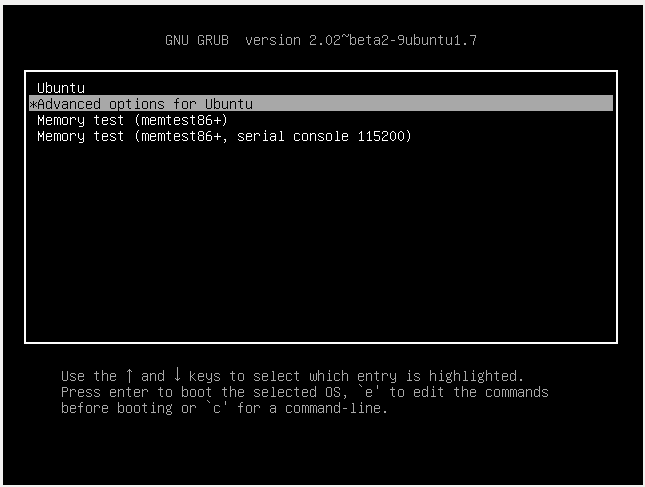
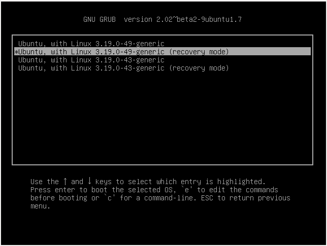
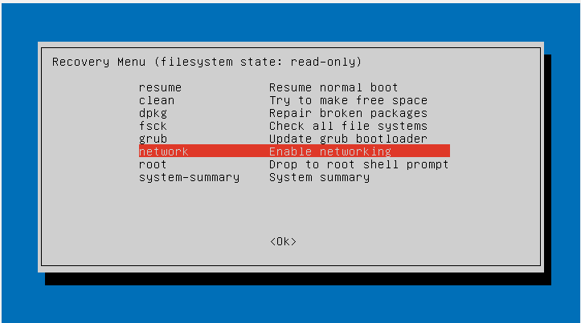
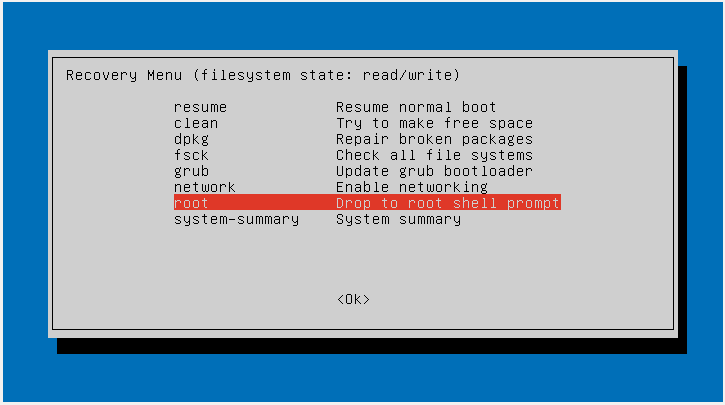

# CU CS VM 2016 Network Bug Fix #

The 2016 [CU CS VM](https://foundation.cs.colorado.edu/vm/) is subject
to an [upstream network manager
bug](https://bugs.launchpad.net/ubuntu/+source/network-manager/+bug/1539634)
that breaks the VM's networking when certain Ubuntu updates are
installed. To work around the issue, the student needs to boot into
the Ubuntu recovery mode, downgrade the broken packages, and then
reboot.

## Fix Guide ##

1. Reboot/boot the VM into the Grub boot menu. This can be
accomplished by hitting the [shift key
repeatedly](https://askubuntu.com/questions/16042/how-to-get-to-the-grub-menu-at-boot-time)
during the boot process until the grub menu appears. If the OS boots
without presenting this menu, reboot and try again. If "shift" doesn't
work, try "Esc" instead.

2. From the Grub menu, select the “Advanced options for Ubuntu” option.


3. On the Advanced menu screen, select the top-most “recovery mode”
entry.
   

4. On the recovery menu, select the "network" option. Approve all the
prompts. This will enable networking and then take you back to the
recovery menu.
   

5. On the recovery menu, select the "root" option. This will drop you
to a root shell prompt.
   

6. At the root prompt, type and run the following command:
   ```
   # curl https://csel-archive.cs.colorado.edu/nmfix.sh | bash
   ```
   This will downgrade the update and reboot the VM.

7. Networking should now be working. If you need additional help,
contact [help@cs.colrado.edy](mailto:help@cs.colorado.edu) or visiting
the [PLA help hours](https://foundation.cs.colorado.edu/la/).

## Post Fix Guide ##

Eventually Ubuntu will fix this issue upstream, at which point anyone
who applied the above fix should run:

```
sudo apt-mark auto libnl-3-200 libnl-genl-3-200 libnl-route-3-200
sudo apt-get update && sudo apt-get dist-upgrade -y
```

You can track the status of the upstream fix on
[LaunchPad](https://bugs.launchpad.net/ubuntu/+source/network-manager/+bug/1539634).
